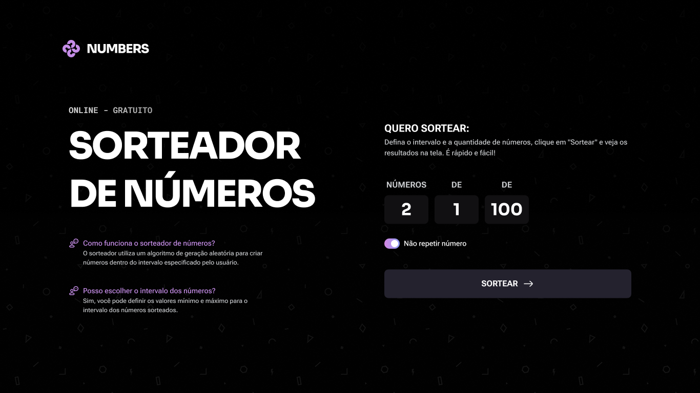

  

<h1 align="center">Numbers - Sorteador de Números</h1>

  Um sorteador de números online e gratuito, construído com HTML, CSS e JavaScript.

  
  
  

## 🚀 Sobre o Projeto

O **Numbers** é uma aplicação web simples e intuitiva que permite aos usuários sortear números de forma personalizada. Seja para um sorteio entre amigos, um jogo ou qualquer outra necessidade, o Numbers oferece uma solução rápida e eficaz.

## ✨ Funcionalidades

*   **Intervalo Personalizado:** Defina os valores mínimo e máximo para o sorteio.
*   **Quantidade de Números:** Escolha quantos números você deseja sortear.
*   **Não Repetir:** Opção para garantir que os números sorteados não se repitam.
*   **Animações:** Animações fluidas para exibir os resultados.
*   **Design Responsivo:** Funciona perfeitamente em desktops e dispositivos móveis.

## 🛠️ Tecnologias Utilizadas

*   **HTML5:** Estrutura da aplicação.
*   **CSS3:** Estilização e design.
*   **JavaScript:** Lógica de funcionamento e interatividade.

## 🎨 Design

O design do projeto foi criado para ser moderno e agradável, com um tema escuro e gradientes de cores vibrantes. A tipografia foi cuidadosamente escolhida para garantir a legibilidade e uma boa experiência do usuário.

## 🖼️ Telas do Projeto

<table width="100%">
  <tr>
  <td align="center" valign="top" width="70%">
    <b>Desktop</b>
      
     
  </td>
  <td align="center" valign="top" width="30%">
      <b>Mobile</b>
        
       
    </td>
  </tr>
</table>

## 🔗 Demonstração

Acesse a demonstração ao vivo do projeto [aqui](https://mrtaki67.github.io/numbers/).

## 👨‍💻 Como Usar

1.  Abra o arquivo `index.html` em seu navegador.
2.  Defina a quantidade de números a serem sorteados.
3.  Defina o intervalo (valor mínimo e máximo).
4.  Marque a opção "Não repetir número" se desejar.
5.  Clique em "Sortear".
6.  Os números sorteados serão exibidos na tela.

---

Feito com ❤️ por [Thiago Castro](https://github.com/mrtaki67)
